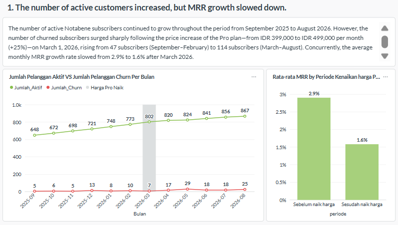
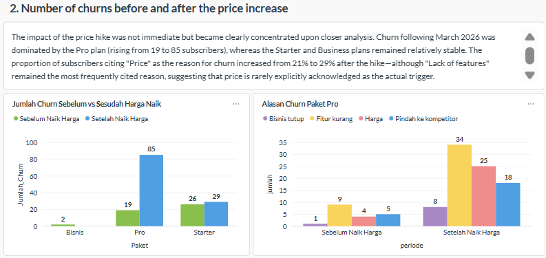
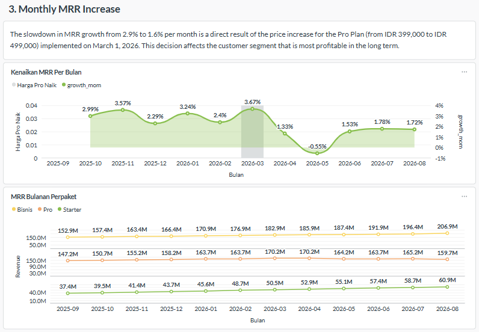
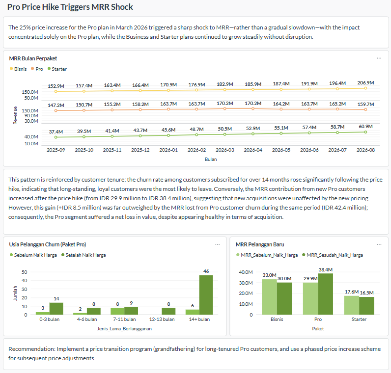

# Churn & MRR Root-Cause Analysis for Notabene (SaaS FinTech)

## Executive Summary

Using **SQL (SQLite) and Metabase**, I built a 4-tab diagnostic dashboard to investigate why Notabene — a B2B SaaS company — saw customer churn double (47→114) and MRR growth decelerate (2.9%→1.6%/month) even as its active customer base kept growing.

After tracing the timing, package concentration, and behavioral signals behind the churn spike, I found that **a 25% price increase on the Pro tier (March 2026) triggered a lagged churn response concentrated almost entirely in long-tenured Pro customers** — and that headline customer-count growth was masking a net loss in recurring revenue value. I recommend the product/growth team:

1. Launch a **grandfathered price-transition program** for long-tenured Pro customers before any future price change
2. Shift the primary growth KPI from **active customer count to MRR-per-segment**, so revenue erosion isn't hidden behind headcount growth
3. Build a **usage-based early-warning alert** (active users ÷ seats) to flag at-risk accounts 1–2 months before they churn
4. Investigate Pro's feature gap directly — "feature limitations" remained the top cited churn reason even after the price increase

## Business Problem

Notabene's active customer base grew every month across a 12-month window (Sep 2025–Aug 2026), which on the surface looked healthy. But two deteriorating trends were hiding underneath: customer churn more than doubled following the company's first price increase in three years (Pro tier, +25%, March 2026), and MRR growth nearly halved over the same period. Leadership needed to know: **is this churn spike actually caused by the price change, which customer segments are driving it, and is the business's underlying revenue health as strong as the customer-count trend suggests?**

Without a consolidated view connecting customer records, monthly usage logs, pricing history, and exit-survey data — five separate data sources — this couldn't be answered from static spreadsheet reporting alone.

## Diagnostic Framework

I structured the dashboard around a **Symptom → Proof → Root Cause → Verdict** flow, so each tab builds directly on the one before it:

```
 SYMPTOM                PROOF                  ROOT CAUSE              VERDICT
 ─────────              ─────────              ─────────────           ─────────
 Active customers   →   Churn concentrated  →  MRR growth crashes  →   Price increase
 keep growing, but      in Pro tier,           post-price-increase,    triggered an
 churn doubles &        1-2 month lag          isolated to Pro         MRR shock in
 MRR growth stalls      after price hike        while other tiers      long-tenured
                        + usage drops           grow uninterrupted      Pro accounts —
                        before churn                                    reframe growth
                                                                         KPI around
                                                                         revenue, not
                                                                         headcount
```

## Dashboard

**1. Symptom** — the headline anomaly: customers up, churn up, MRR growth down


**2. Proof** — churn is concentrated in Pro, lags the price change by 1–2 months, and is preceded by a measurable drop in usage


**3. Root Cause** — the MRR growth trend and per-package revenue confirm the disruption is isolated to Pro


**4. Verdict** — synthesis and recommendations


## Data

| Source | Grain | Key fields |
|---|---|---|
| `Pelanggan` | 1 row per customer (~1,300) | Paket, Kursi, MRR, TanggalDaftar, Status, TanggalChurn, AlasanChurn |
| `AktivitasBulanan` | 1 row per customer per month | PenggunaAktif, TotalLogin, TiketSupport |
| `HargaPaket` | Price history per package | HargaLama, HargaBaru, BerlakuSejak |
| `ChurnAlasan` | Exit-survey weights | — |
| `SnapshotBulanan` | Target MRR per month | — |

## Data Quality Issues I Caught

Two bugs surfaced during development that would have flipped the conclusions if left unfixed — worth calling out because catching them was part of the actual analytical work:

- **Survivorship bias in the churn trend:** an early query joined `Pelanggan` to `AktivitasBulanan` and filtered on customer status, which unintentionally counted a churned customer only in the months *before* they left — producing a churn count that *declined* over time. Fixed by deriving churn month directly from `TanggalChurn` instead of activity records.
- **Misleading proportional-growth claim:** an early draft cited a "+525% increase" in customers citing "Price" as their churn reason. That was raw count growth (4→25), not a proportional shift — and a smaller-base reason ("Business closed," 1→8) actually grew faster in relative terms. Corrected to report the true proportional shift (21%→29%).

## Tools

SQL (window functions, CTEs, CASE-based segmentation) · Metabase (native SQL questions, dashboard filters)

*Built for a Business Intelligence course case study (Metabase was the required tool). The core analytical workflow — metric design, SQL, and root-cause storytelling — transfers directly to Tableau/Power BI.*

## Queries

SQL used for the key metrics is in [`/queries`](./queries), including MRR growth rate (window functions), churn segmentation before/after the price change, and the usage-ratio early-warning signal.
